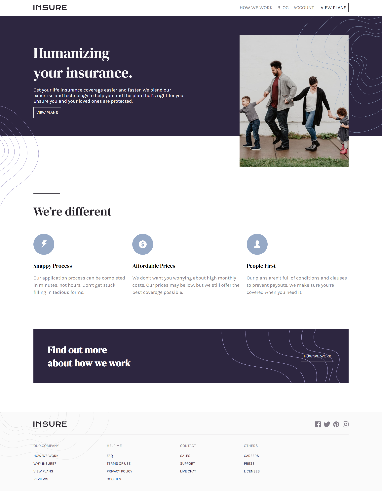

# Frontend Mentor - Insure landing page solution

This is a solution to the [Insure landing page challenge on Frontend Mentor](https://www.frontendmentor.io/challenges/insure-landing-page-uTU68JV8). Frontend Mentor challenges help you improve your coding skills by building realistic projects.

## Table of contents

- [Overview](#overview)
  - [The challenge](#the-challenge)
  - [Screenshot](#screenshot)
  - [Links](#links)
- [My process](#my-process)
  - [Built with](#built-with)
  - [What I learned](#what-i-learned)
  - [Continued development](#continued-development)
  - [Useful resources](#useful-resources)
- [Author](#author)
- [Acknowledgments](#acknowledgments)

## Overview

### The challenge

Users should be able to:

- View the optimal layout for the site depending on their device's screen size
- See hover states for all interactive elements on the page
- Toggle the mobile navigation menu using JavaScript

### Screenshot



### Links

- Solution URL: [](https://github.com/JohnsonSaka123/insure-landing-page-master.git)
- Live Site URL: [](https://johnsonsaka123.github.io/insure-landing-page-master/)

## My process

### Built with

- Semantic HTML5 markup
- CSS custom properties
- Flexbox
- CSS Grid
- Mobile-first workflow
- Vanilla JavaScript (for mobile navigation)

### What I learned

While working on this project, I practiced structuring a fully responsive layout using CSS Grid and Flexbox. I also implemented a JavaScript-powered mobile navigation toggle that enhances usability on smaller devices.

Here’s a small example of the navigation toggle logic:

```js
const navToggle = document.querySelector('.nav-toggle');
const navLinks = document.querySelector('.nav-links');

navToggle.addEventListener('click', () => {
  navLinks.classList.toggle('active');
});
```